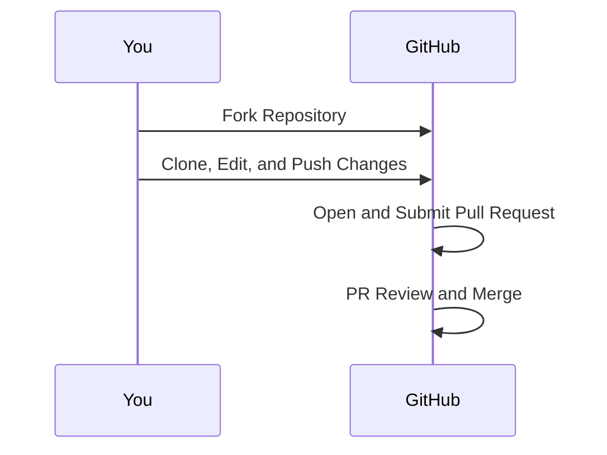

# How to Create a Pull Request on GitHub

Creating a Pull Request (PR) on GitHub isn’t just for coders; It’s a valuable skill for anyone looking to contribute to open-source projects or showcase their work. Whether you’re a developer or author, this guide will guide you through the PR process to share your contributions with the world.

## Fork the Original Repository

* Navigate to the GitHub repository you want to contribute.
* Click on the ‘Fork’ button in the top right corner. This process creates a copy of the repository in your own GitHub account.


## Clone your Repository

* Clone the forked repository to your local machine. This creates a local version that you can edit.
* Run the `git clone` command with your repository URL.

```bash
git clone https://github.com/yourusername/repository-name.git
```


## Branch out

* Create a new branch before making changes. Branches help keep your changes organized and isolate you from the main business.
* Use the `git checkout -b <your-branch-name>` command to create a new branch and switch to it.

```bash
git checkout -b feature/my-contributions
```

## Make your changes

* Now, it’s time to add your contribution. If you’re a writer, you’re probably adding markdown files, documents, or other formats, and if you are developer, you would like to make changes in the code files.
* Put your files in the correct directory in your local repository.

## Commit changes

* After adding your work, commit these changes to your branch. This is like saving your progress.
* Use `git add` to stage your changes and `git commit -m "Your commit message"` to commit.

```bash
git in it
git commit -m "Added my text section".
```

## Push to GitHub

Push your branch and its changes to your GitHub fork using the `git push` command.

```bash
git push origin feature/my-contributions
```

## Create a Pull Request

* Go to the original repository on GitHub, click `Pull Request`, then click `Pull New Request`.
* Select your branch from the list and fill in the PR information. Explain what you have added or changed.


## Wait for Review

Submit a PR, wait for the reviewers to review it, and if all looks good, put it together for the main project.

Throughout these steps, remember to follow any contribution guidelines set by the project. Here is a diagram to visualize the process:



This flow ensures that your contributions are organized and properly integrated into the original project. 
