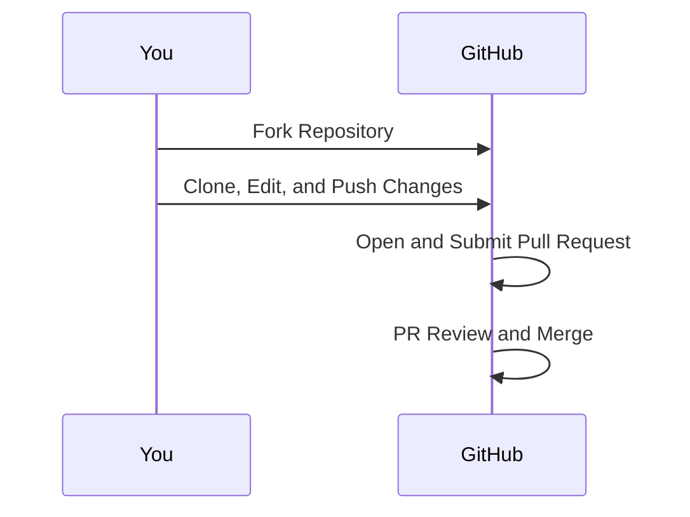

# How to Create a Pull Request on GitHub

Creating a Pull Request (PR) on GitHub is not just for coders; it's a valuable skill for anyone looking to contribute to open-source projects or showcase their work. Whether you're a developer or writer, this guide will walk you through the process of making a PR to share your contributions with the world.

## Step 1: Fork the Original Repository

1. Go to the GitHub repository you want to contribute to.
2. Click on the 'Fork' button at the top right corner. This action creates a copy of the repository in your own GitHub account.


## Step 2: Clone Your Fork

1. Clone the forked repository to your local machine. This creates a local version that you can edit.
2. Use the `git clone` command with your repository’s URL.

```bash
git clone https://github.com/YourUsername/repository-name.git
```

## Step 3: Branch Out

1. Before making changes, create a new branch. Branches help keep your changes organized and separate from the main project.
2. Use the `git checkout -b <your-branch-name>` command to create a new branch and switch to it.

```bash
git checkout -b feature/my-contribution
```


## Step 4: Make Your Contributions

1. Now, it’s time to add your contributions. If you're a writer, you might be adding markdown files, documents, or other formats.
2. Place your files in the appropriate directory in your local repository.


## Step 5: Commit Your Changes

1. After adding your work, commit these changes to your branch. This is like saving your progress.
2. Use `git add` to stage your changes and `git commit -m "Your commit message"` to commit them.

```bash
git add .
git commit -m "Added my writing portfolio"
```

## Step 6: Push to GitHub

1. Push your branch and its changes to your GitHub fork using the `git push` command.

```bash
git push origin feature/my-contribution
```

## Step 7: Create the Pull Request

1. Go to the original repository on GitHub, click on 'Pull Requests', and then 'New Pull Request'.
2. Select your branch from the list and fill in the PR details. Explain what you’ve added or changed.


## Step 8: Await Review

1. After submitting the PR, wait for the maintainers to review and, if all looks good, merge it into the main project.

Throughout these steps, remember to follow any contribution guidelines set by the project. Here's a simplified Mermaid diagram to visualize the process:



This flow ensures that your contributions are organized and properly integrated into the original project. Happy contributing!